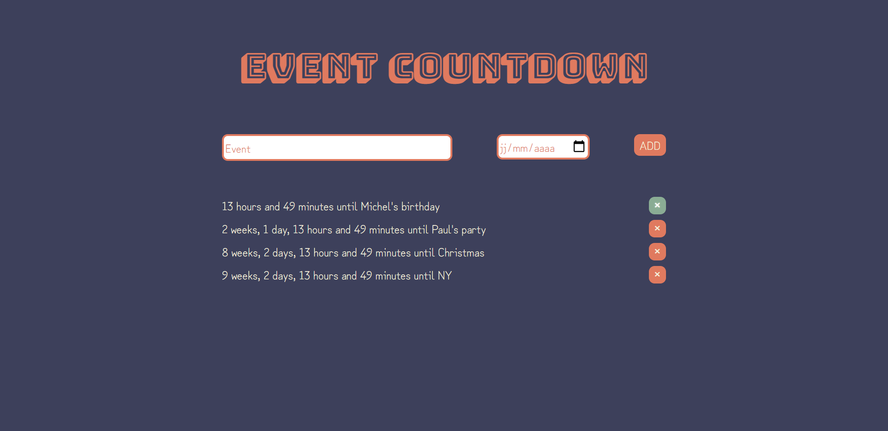

# Event Countdown

Countdown to the dates of events added by the user. Each event is added to a list and given an individual countdown (until the event date at midnight). The events and respective dates are stored until the date of the event or manual deletion.

---

#### Developed knowledge of

- Date manipulation
- Intervals
- Local storage

#### Languages Used

- HTML
- SCSS
- JavaScript

#### Plus

- NPM 
- Parcel
- ESLint 
- Prettier

---

### Preview

